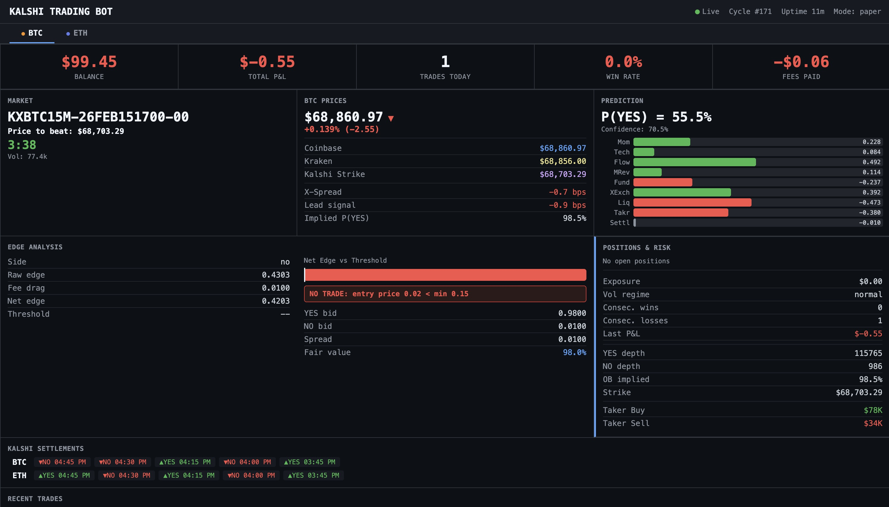

# Kalshi Trading Bot

Automated trading bot for [Kalshi](https://kalshi.com) prediction markets, targeting **15-minute price movement contracts** (`KXBTC15M`, `KXETH15M`). Monitors real-time price feeds from multiple exchanges, estimates settlement probability via a 9-signal heuristic model, identifies mispriced contracts, and executes trades with strict risk management.

**Multi-asset** · **Real-time dashboard** · **Paper & live modes** · **Fee-aware Kelly sizing**



---

## Quick Start

### Prerequisites

| Requirement | Notes |
|---|---|
| **Python 3.11+** | `python3 --version` |
| **Kalshi account** | [kalshi.com](https://kalshi.com) |
| **Kalshi API key** | RSA key pair (see below) |

### Setup

```bash
# 1. Generate Kalshi API key
openssl genrsa -out kalshi_key.pem 4096
openssl rsa -in kalshi_key.pem -pubout -out kalshi_key_pub.pem
# Upload kalshi_key_pub.pem at kalshi.com account settings

# 2. Install
git clone <repo-url> && cd kalshi-btc-bot
python3 -m venv .venv && source .venv/bin/activate
pip install -e .

# 3. Environment variables
export KALSHI_API_KEY_ID="your-api-key-id"
export KALSHI_PRIVATE_KEY_PATH="/path/to/kalshi_key.pem"

# 4. Run (paper mode, safe default)
kalshi-bot --dry-run
```

### Running Live

```bash
# Production
kalshi-bot --mode live --env prod

# With risk overrides
kalshi-bot --mode live --env prod --max-exposure 1000 --max-daily-loss 200
```

### CLI Reference

| Flag | Short | Description |
|------|-------|-------------|
| `--config PATH` | `-c` | Settings YAML (default: `config/settings.yaml`) |
| `--mode {paper,live}` | `-m` | Trading mode |
| `--env {demo,prod}` | `-e` | Kalshi environment |
| `--log-level LEVEL` | `-l` | `DEBUG` / `INFO` / `WARNING` / `ERROR` |
| `--max-exposure $` | | Max total exposure |
| `--max-daily-loss $` | | Max daily loss |
| `--dry-run` | | Shortcut: `--mode paper --env demo` |

---

## How It Works

### Main Loop (every ~4 seconds)

1. **Snapshot** — Aggregate prices (Coinbase, Kraken), Kalshi orderbook
2. **Features** — Compute 23 features: momentum, technicals, order flow, cross-exchange signals, settlement bias, cross-asset divergence, time decay
3. **Predict** — 9 weighted signals → P(YES) estimate with market-direction anchor and confidence score
4. **Edge** — Compare model probability vs Kalshi implied probability, subtract fees, apply per-asset multipliers
5. **Filter** — Phase gating, trend guard, edge persistence, zone filter, min price filter
6. **Risk** — 9 independent safety checks with per-asset position limits
7. **Execute** — Kelly-sized limit order if edge > threshold and all checks pass
8. **Monitor** — Trailing take-profit, stop-loss, pre-expiry exit

### Strategy Types

| Strategy | Assets | Trigger | Description |
|----------|--------|---------|-------------|
| **Directional** | BTC | `net_edge > threshold` for N consecutive cycles | Model vs market probability mismatch |
| **Market Making** | BTC, ETH | Wide spread (5-30%) | Resting limit orders to capture bid-ask spread |

ETH runs in **MM-only mode** — directional trading is disabled for ETH due to lower win rates from higher volatility. BTC directional is the primary profit engine.

### Per-Asset Risk Profiles

| Setting | BTC | ETH |
|---------|-----|-----|
| Strategy | Directional + MM | **MM-only** |
| Stop-loss | 15% | 20% (wider for volatility) |
| Max position | 25 contracts | 10 contracts |
| Max per cycle | 15 contracts | 10 contracts |
| Edge multiplier | 1.0x | 2.0x |

### Phase-Gated Trading

Each 15-minute window is divided into 5 phases:

| Phase | Window | Behavior |
|-------|--------|----------|
| 1. Observation | 0–3 min | No directional trades; record momentum direction |
| 2. Confirmation | 3–8 min | Only trade if bounce-back from Phase 1 overreaction |
| 3. Active | 8–12 min | Normal trading with full edge/confidence thresholds |
| 4. Late | 12–14 min | Tightened thresholds (1.3x edge, +5% confidence) |
| 5. Final | 14–15 min | No new entries — contracts are unpredictable near settlement |

### Entry Filters

- **Edge persistence** — Require 2 consecutive cycles with same-side edge before entry
- **Trend guard** — Block trades against unanimous multi-timeframe momentum
- **Min entry price** — No entries below $0.25 (cheap contracts lose money)
- **Zone filter** — Block expensive directional trades above $0.60
- **Quality score** — Combined edge + confidence must exceed minimum threshold

### Edge Calculation

```
model_prob = heuristic_model(features)     # 9-signal weighted sum, ±0.30 range
                                           # + market-direction anchor (30% blend)
market_prob = kalshi_midpoint              # e.g., 0.55
raw_edge = |model_prob - market_prob|      # 0.07
net_edge = raw_edge - fee_drag             # ~0.04
→ Trade if net_edge > min_threshold (5%) × asset_multiplier × zone_multiplier
```

### Exit Management

| Exit Type | Trigger | Description |
|-----------|---------|-------------|
| **Trailing take-profit** | Activate at +$0.08/contract, exit on $0.05 drop from peak | Let winners run |
| **Stop-loss** | 15% loss (BTC) / 20% loss (ETH) from entry | Cut losers early |
| **Pre-expiry exit** | 90 seconds before settlement | Sell if PnL ≥ -$0.03/contract |
| **TP cooldown** | 15 min after take-profit | Block re-entry in same window |

### Risk Checks (all must pass)

1. Balance ≥ minimum
2. Daily P&L above loss limit
3. Per-market position < cap (per-asset limits)
4. Total exposure < cap
5. Concurrent positions < limit
6. Consecutive losses < streak max
7. Trades today < daily limit
8. Entry cooldown (30s between fills on same market)
9. Time to expiry > 60 seconds

### Position Sizing

**Fractional Kelly Criterion** with adjustments:
- Per-asset caps: different max positions for BTC vs ETH
- Zone scaling: better risk:reward zones → larger size
- Time scaling: reduce size as expiry approaches
- Vol regime: tighter sizing in high volatility
- Per-cycle cap: max contracts per single order (per-asset)
- Minimum position size: skip tiny positions below threshold

---

## Dashboard

Real-time browser dashboard at `http://localhost:8080` via Server-Sent Events (SSE).

**Summary bar** — Balance, Total P&L, Trades Today, Win Rate at a glance
**Per-asset tabs** — BTC/ETH with independent market, price, prediction, and edge panels
**Live data** — Countdown timer, price ticker with delta, 9 signal bars, orderbook stats
**Positions** — Color-coded YES/NO with risk stats
**Settlements** — Compact inline badges showing recent market outcomes
**Trade history** — Per-asset with P&L coloring
**Features** — Collapsible 29-feature grid
**Decision log** — Last 15 cycle decisions

---

## Configuration

All settings in `config/settings.yaml`:

| Setting | Default | Description |
|---|---|---|
| `mode` | `paper` | `paper` or `live` |
| `kalshi.environment` | `prod` | `demo` or `prod` |
| `strategy.poll_interval_seconds` | `4` | Main loop interval |
| `strategy.min_edge_threshold` | `0.05` | Minimum edge to trade (5%) |
| `strategy.confidence_min` | `0.62` | Minimum model confidence |
| `strategy.asset_edge_multipliers` | `{ETH: 2.0}` | Per-asset edge penalty |
| `strategy.asset_directional_disabled` | `[ETH]` | MM-only assets |
| `risk.max_position_per_market` | `25` | Max contracts per market |
| `risk.max_total_exposure_dollars` | `500` | Total capital at risk |
| `risk.max_daily_loss_dollars` | `300` | Daily loss stop |
| `risk.max_concurrent_positions` | `5` | Max open positions |
| `risk.kelly_fraction` | `0.20` | Kelly fraction for sizing |
| `risk.asset_max_position` | `{ETH: 10}` | Per-asset position caps |
| `risk.asset_max_per_cycle` | `{ETH: 10}` | Per-asset cycle caps |

### Per-Asset Config

```yaml
kalshi:
  assets:
    - series_ticker: "KXBTC15M"
      symbol: "BTC"
      primary_ws_url: "wss://ws-feed.exchange.coinbase.com"
      primary_symbol: "BTC-USD"
      secondary_ws_url: "wss://ws.kraken.com/v2"
      secondary_symbol: "BTC/USD"
    - series_ticker: "KXETH15M"
      symbol: "ETH"
      # ...
```

---

## Project Structure

```
├── config/
│   └── settings.yaml              # All configurable parameters
├── src/
│   ├── bot.py                     # Main orchestrator — 5 concurrent loops
│   ├── config.py                  # Pydantic settings with validation
│   ├── data/
│   │   ├── binance_feed.py        # WS price feeds (Coinbase/Kraken/Binance)
│   │   ├── kalshi_client.py       # Kalshi REST client (markets, orders, balance)
│   │   ├── kalshi_ws.py           # Kalshi WS (orderbook deltas, fills)
│   │   ├── kalshi_auth.py         # RSA-PSS authentication
│   │   ├── data_hub.py            # Unified aggregator → MarketSnapshot
│   │   ├── market_scanner.py      # Active market discovery
│   │   ├── time_profile.py        # Historical kline profiling
│   │   ├── database.py            # SQLite persistence (async)
│   │   └── models.py              # Data models (Tick, Snapshot, Order, etc.)
│   ├── features/
│   │   ├── feature_engine.py      # Snapshot → 23 features
│   │   └── indicators.py          # RSI, BB, MACD, ROC, VWAP
│   ├── model/
│   │   ├── predict.py             # Heuristic model (9 signals → P(YES))
│   │   ├── calibrate.py           # Probability calibration
│   │   └── train.py               # LightGBM training pipeline
│   ├── strategy/
│   │   ├── signal_combiner.py     # Signal prioritization
│   │   ├── edge_detector.py       # Model vs market edge calculation
│   │   ├── fomo_detector.py       # Contrarian retail panic detector
│   │   ├── market_maker.py        # Spread capture strategy
│   │   └── averager.py            # Asymmetric pyramiding
│   ├── risk/
│   │   ├── risk_manager.py        # 9 safety checks
│   │   ├── position_sizer.py      # Fractional Kelly sizing
│   │   └── volatility.py          # Vol regime tracking
│   ├── execution/
│   │   ├── order_manager.py       # Order lifecycle (paper + live)
│   │   └── position_tracker.py    # Position state, exits, P&L
│   └── dashboard/
│       ├── server.py              # aiohttp SSE server
│       └── page.py                # Inline HTML/CSS/JS dashboard
├── backtest/
│   ├── data_collector.py          # Historical data collection
│   ├── backtester.py              # Strategy backtesting engine
│   └── analysis.py                # Performance analysis
├── scripts/                       # Utility scripts
├── data/                          # SQLite database + candle cache
└── pyproject.toml                 # Dependencies
```

---

## Database Schema

| Table | Purpose |
|-------|---------|
| `trades` | Completed trades (order_id, ticker, side, price, fees, pnl) |
| `predictions` | Model predictions with features for backtesting |
| `outcomes` | Market settlement results |
| `ticks` | Raw price ticks for replay |
| `daily_summary` | Aggregated daily P&L |

---

## Optional Extras

```bash
pip install -e ".[ml]"        # LightGBM model training
pip install -e ".[backtest]"  # Backtesting visualization
pip install -e ".[dev]"       # pytest, mypy, ruff
```

## Testing

```bash
pytest tests/ -v
pytest tests/ --cov=src --cov-report=term-missing
```

## API References

- **Kalshi REST**: `https://api.elections.kalshi.com/trade-api/v2/`
- **Kalshi Demo**: `https://demo-api.kalshi.co/trade-api/v2/`
- **Auth**: RSA-PSS signatures (SHA256)
- **Docs**: [trading-api.readme.io/reference](https://trading-api.readme.io/reference)
